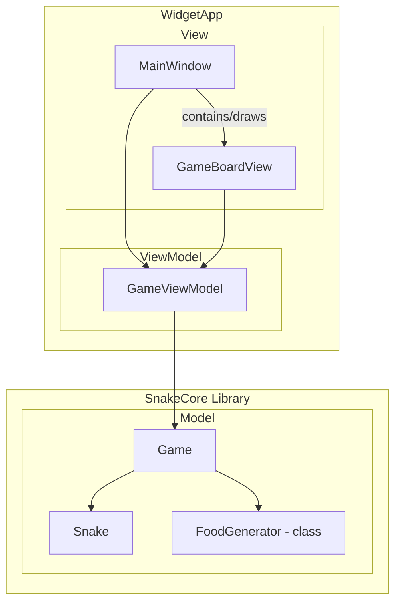

# Hello (again) Qt and C++ World
Its been a while since my last contact with C++ and I've never made a deep dive into Qt. Although I had some contact. Now is the time to visit this world again and see whether it thrills me enough to work as a C++ developer. This project should serve the following purposes:
1. Get to know the current version of [Qt](https://www.qt.io/) and its ecosystem
2. See how quickly my rusty C++ skills become active again
3. Show how I usually develop (as far as that is possible with such a simple example)
4. [Document my "learnings"](today-i-learned.md) (based on the Today I Learned (TIL) approach as seen by [Josh Branchaud](https://github.com/jbranchaud/til))

## Requirements
### Functional Requirements
Based on my believe that a software's primary purpose it to provide value to its user (e.g. simplify repetitive tasks for the user or provide some entertainment in this case), the functional requirements are defined as user stories. Looking into user stories I agree with [this article from John Hayse](https://johnhayes.medium.com/the-forgotten-agility-of-user-stories-d24bde0f8b0a):
> A user story is a story your team can tell about being a user of your product.

Therefore I'm using the issue [Tale of a snake - a "real" user story](https://github.com/suchja/awesome-qt-snake/issues/1) as a definition of the functional requirements.

### Non-Functional Requirements (NFR)
Often non-functional requirements are expressed as user stories as well. I somehow don't like that approach, because non-functional requirements are often not expressed by the user.

So the NFRs for this simple (or maybe not that simple) project are as follows:

- **NFR-1 - Ease of use** - The game should be easy to use on a desktop computer. Users are familiar with the keyboard and as such this should be the major input device.
- **NFR-2 - Supported OS** - The game will be deployed to the latest versions of Windows and macOS.
- **NFR-3 - Extensibility (UI)** - Obviously the core functionality will not be extended. However, this project serves learning purposes and as such it should easily be possible to realise the UI with different technologies (e.g. Qt Widget, Qt Quick, OpenGL, ...).
- **NFR-4 - Modular Design** - Although it is, for a small project like this, oversized, a modular design should be applied. Thus it is possible to show case my experience with concepts like (e.g. MVVM/MVC, SOLID, Clean Code, ...) AND learn how they apply to C++ and Qt.

## Workflow / Development Lifecycle
As stated in the previous section, one purpose of this project is to show case my way of tackling a development task. For this project I decided to go with some agility in mind:
- Understand requirements by defining user stories.
- Ensure a certain quality (with regards to functional and non-functional requirements) by using a test-driven approach.
- Ensure there is always an executable and versioned product by following the "GitHub Flow" approach
- Use traceability between requirements and code changes. This supports me and potential helpers during maintenance.
- Document key decisions, but use clean and solid code as the core documentation.
- Create spikes (prototypes) for learning and throw them away.
- Use state of the art technology, but generally keep the code as simple as possible so that unexperienced developers can understand the code easily.
- Use an incremental development approach so that a continuous evaluation is possible.

## Design Decisions
### Model-View-ViewModel (MVVM) as core pattern
As already stated a simple example like this should be implemented in a simple way. However, I also have the requirement to show and test some of my knowledge (see **NFR-3** and **NFR-4** in [Non-Functional Requirements](#non-functional-requirements-nfr)). Therefore I decided to use the MVVM pattern to provide a general structure. I know this pattern well from .NET. It seems like it is also applied frequently in **Qt Quick**. Additionally it is geared towards an "easy" replacement of its parts. So **NFR-3 - Extensibility (UI)** should greatly benefit from this decision. Here is a first idea how it might look like:

#### Dependency on Qt in MVVM
From my understanding of MVVM the Model should contain all the business logic. Thus it usually has a long lifecycle and should not use technology which might change within a few years. Therefore I would argue that it shouldn't depend on Qt. Although it is porbably a company decision to depend on a framework like Qt, this might change over the years. If the core business logic is then dependend on it, it needs to be revised as well.
Anyhow, Qt offers the signals/slots as well as the "garbage collection" and thus I decided to use Qt::Core as the basis for the `SnakeCore` library. That means all classes within the library will inherit from `QObject`. Maybe later on I can remove certain dependencies, if it shows to be obsolete.

#### Injecting `ViewModel` into `View` via `setViewModel` method
Here I'll not use any *Dependency Injection Container* or something like that. Usually I then use the constructor to inject the dependencies. However, here I'm using a dedicated method on the View to inject the dependency to the ViewModel. I would argue that it will have the following benefits:
1. **Flexibility in Initialization**: By using a setter method (`setViewModel`), you decouple the instantiation of the `ViewModel` from the `View` itself. This separation allows you to initialize and set the `ViewModel` independently of creating the `View`.
2. **Late Binding**: The `setViewModel` method supports late binding, meaning you can change the `ViewModel` instance associated with a `View` dynamically at runtime if required. - Although I'm not sure whether this is required here at all.
3. **Separation of Concerns**: The constructor of `View` should ideally focus on initializing its own internal components and setting up basic functionality. Handling the `ViewModel` assignment through a setter method keeps the constructor cleaner.

As I'm not that familiar with this way of injection, it is more like a try. I'll need to come back later on and see whether this really holds true and improves the overall design. Additionally this so far takes only *Qt Widget* into account. I'll see how things work in *Qt Quick*, once I've completed the widget way.
